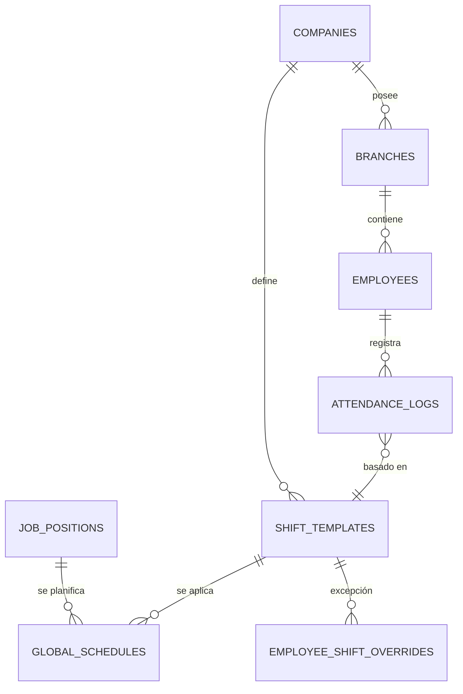

# Esquema de Base de Datos — Gestor360

Este documento describe las tablas, columnas y relaciones de la base de datos en **Supabase (PostgreSQL)**.

---

## Tablas

### `companies`
Empresas registradas en el sistema (arquitectura multitenant).

| Columna           | Tipo        | Descripción                                      |
|-------------------|-------------|--------------------------------------------------|
| `id`              | `uuid` PK   | Identificador único                              |
| `display_name`    | `text`      | Nombre comercial de la empresa                   |
| `legal_name`      | `text`      | Razón social / nombre legal                      |
| `slug`            | `text` UNIQUE | Identificador URL-amigable                     |
| `tax_id`          | `text`      | RUC / NIT fiscal                                 |
| `address`         | `text`      | Dirección física                                 |
| `phone`           | `text`      | Teléfono de contacto                             |
| `report_logo_url` | `text`      | URL del logo para reportes                       |
| `is_active`       | `bool`      | Estado activo/inactivo                           |
| `created_at`      | `timestamptz` | Fecha de creación                              |

---

### `branches`
Sucursales pertenecientes a una empresa.

| Columna      | Tipo        | Descripción                              |
|--------------|-------------|------------------------------------------|
| `id`         | `uuid` PK   | Identificador único                      |
| `company_id` | `uuid` FK   | Empresa propietaria → `companies.id`     |
| `name`       | `text`      | Nombre de la sucursal                    |
| `code`       | `text`      | Código corto (usado en device_code)      |
| `address`    | `text`      | Dirección de la sucursal                 |
| `is_active`  | `bool`      | Estado activo/inactivo                   |
| `created_at` | `timestamptz` | Fecha de creación                      |

---

### `employees`
Empleados de la empresa, con perfil completo.

| Columna              | Tipo        | Descripción                                    |
|----------------------|-------------|------------------------------------------------|
| `id`                 | `uuid` PK   | Identificador único                            |
| `company_id`         | `uuid` FK   | Empresa → `companies.id`                       |
| `branch_id`          | `uuid` FK   | Sucursal asignada → `branches.id`              |
| `employee_code`      | `text`      | PIN de marcación (4 dígitos, único por empresa)|
| `first_name`         | `text`      | Nombre(s)                                      |
| `last_name`          | `text`      | Apellido(s)                                    |
| `email`              | `text`      | Correo electrónico                             |
| `phone`              | `text`      | Teléfono                                       |
| `hire_date`          | `date`      | Fecha de ingreso                               |
| `birth_date`         | `date`      | Fecha de nacimiento                            |
| `gender`             | `text`      | Género                                         |
| `address`            | `text`      | Dirección de residencia                        |
| `national_id`        | `text`      | Número de cédula / DUI                         |
| `social_security_id` | `text`      | Número de INSS                                 |
| `tax_id`             | `text`      | NIT personal                                   |
| `photo_url`          | `text`      | URL de foto en Storage                         |
| `job_position_id`    | `uuid` FK   | Puesto de trabajo → `job_positions.id` (Nivel Jerárquico) |
| `current_status`     | `text`      | Estado para Monitor: `active`, `on_break`, `offline`, `absent` |
| `last_status_change` | `timestamptz` | Última actualización de estado para el Monitor |
| `is_active`          | `bool`      | Estado administrativo (Habilitado/Baja)         |
| `created_at`         | `timestamptz` | Fecha de creación                            |

---

### `employee_pins`
Historial de PINs asignados para auditoría de seguridad.

| Columna       | Tipo      | Descripción                            |
|---------------|-----------|----------------------------------------|
| `id`          | `uuid` PK | Identificador único                    |
| `employee_id` | `uuid` FK | Empleado → `employees.id`              |
| `pin`         | `text`    | PIN de 4 dígitos                       |
| `is_active`   | `bool`    | Indica si el PIN está actualmente activo |
| `created_at`  | `timestamptz` | Fecha de asignación                |

---

### `job_positions` (Jerarquía de Puestos)
Define el árbol organizativo y reglas de descanso.

| Columna              | Tipo        | Descripción                                      |
|----------------------|-------------|--------------------------------------------------|
| `id`                 | `uuid` PK   | Identificador único                              |
| `company_id`         | `uuid` FK   | Empresa → `companies.id`                         |
| `name`               | `text`      | Nombre del puesto (Ej. "Cajero")                 |
| `level`              | `numeric`   | Nivel jerárquico (Ej. 1.0, 2.5)                  |
| `parent_id`          | `uuid` FK   | Puesto supervisor → `job_positions.id`           |
| `default_break_mins` | `int`       | Minutos reglamentarios de descanso               |
| `is_active`          | `bool`      | Estado activo/inactivo                           |
| `created_at`         | `timestamptz` | Fecha de creación                              |

---

### `employee_status_logs`
Historial de estados y auditoría de los tiempos de descanso de los empleados.

| Columna                | Tipo        | Descripción                                      |
|------------------------|-------------|--------------------------------------------------|
| `id`                   | `uuid` PK   | Identificador único                              |
| `employee_id`          | `uuid` FK   | Empleado → `employees.id`                        |
| `start_time`           | `timestamptz` | Hora exacta real a la que inicio la pausa      |
| `end_time_scheduled`   | `timestamptz` | start_time + default_break_mins                |
| `end_time_actual`      | `timestamptz` | Cierre real de la pausa                        |
| `is_complete_override` | `bool`      | Supervisor validó "descanso completo"          |
| `authorized_by`        | `uuid` FK   | Supervisor que autorizó la acción anticipada   |
| `created_at`           | `timestamptz### `shift_templates` (Configuración Maestra de Turnos - FASE 3)
Pieza central del sistema de planificación. Reemplaza gradualmente a la tabla `shifts`.

| Columna | Tipo | Descripción |
| :--- | :--- | :--- |
| `id` | `uuid` PK | Identificador único |
| `company_id` | `uuid` FK | Empresa propietaria → `companies.id` |
| `branch_id` | `uuid` FK | Sucursal (opcional para jerarquía de nivel 4) |
| `name` | `text` | Nombre de la plantilla (Ej. "Administrativo Full") |
| `days_config` | `jsonb` | Matriz de 7 días: `[{dayOfWeek, isActive, isSeventhDay, startTime, endTime}]` |
| `lunch_duration`| `int` | Minutos de descanso / almuerzo (descontables) |
| `late_entry_tolerance` | `int` | Minutos de gracia para entrada (tardanza) |
| `early_exit_tolerance` | `int` | Minutos de gracia para salida anticipada |
| `color_code` | `text` | Color representativo para la UI |
| `is_active` | `bool` | Estado de la plantilla |

---

### `global_schedules` (Planilla Maestra - NIVEL 3)
Define qué turno corresponde a cada puesto en cada día de la semana.

| Columna | Tipo | Descripción |
| :--- | :--- | :--- |
| `id` | `uuid` PK | Identificador único |
| `company_id` | `uuid` FK | Empresa → `companies.id` |
| `job_position_id`| `uuid` FK | Puesto de trabajo → `job_positions.id` |
| `shift_template_id`| `uuid` FK | Plantilla asignada → `shift_templates.id` |
| `day_of_week` | `int2` | Día (0-6) |

---

### `attendance_logs` (Registro de Asistencia Omnicanal)
Maneja las marcaciones del sistema (Kiosk + Monitor). **Reemplaza a `time_records`**.

| Columna | Tipo | Descripción |
| :--- | :--- | :--- |
| `id` | `uuid` PK | Identificador único |
| `employee_id` | `uuid` FK | Empleado → `employees.id` |
| `date` | `date` | Fecha de la jornada laboral |
| `clock_in` | `timestamptz`| Marca de entrada real |
| `clock_out` | `timestamptz`| Marca de salida real |
| `shift_id` | `uuid` FK | Turno resuelto → `shift_templates.id` (o `shifts.id` legacy) |
| `status` | `text` | `on_time`, `late`, `overtime`, `absence` |
| `is_late` | `bool` | Flag calculado de tardanza |
| `minutes_deducted`| `int` | Minutos netos a descontar |
| `overtime_minutes`| `int` | Minutos netos de tiempo extra |
| `is_seventh_day_overtime`| `bool`| True si laboró en día de descanso |

---

### `branch_default_shifts` (Fallback por Sucursal - NIVEL 4)
Configuración base si no existe planilla global para un puesto.

| Columna | Tipo | Descripción |
| :--- | :--- | :--- |
| `branch_id` | `uuid` FK | Sucursal → `branches.id` |
| `day_of_week` | `int2` | Día (0-6) |
| `shift_template_id`| `uuid` FK | Plantilla por defecto |

---

### `employee_shift_overrides` (Excepciones - NIVEL 1)
Máxima prioridad en la jerarquía de resolución.

| Columna | Tipo | Descripción |
| :--- | :--- | :--- |
| `employee_id` | `uuid` FK | Empleado → `employees.id` |
| `scheduled_date` | `date` | Fecha específica del cambio |
| `shift_template_id`| `uuid` FK | Turno de reemplazo |

---

### `shifts` (LEGACY)
> [!WARNING]
> Tabla obsoleta. Use `shift_templates` para nuevos desarrollos. Se mantiene solo para retrocompatibilidad con asignaciones de Nivel 2.

---

### `time_records` (DEPRECATED)
> [!CAUTION]
> No usar. Los datos han sido migrados a `attendance_logs`.

---

## Diagrama de Relaciones Actualizado (Fase 3)



---

*Documentación de base de datos — Gestor360 v1.0.0 (Phase 3 Ready) — 28 de marzo de 2026*
                   shifts        time_corrections
    │         │
    │         └─────────────────── contracts
    │
    └─── company_memberships (users de Supabase Auth)

employees ──► leave_requests
employees ──► incidents

app_settings (global, sin FK)
```

---

*Documentación de base de datos — Gestor360 v0.3.0 — 24 de marzo de 2026*
