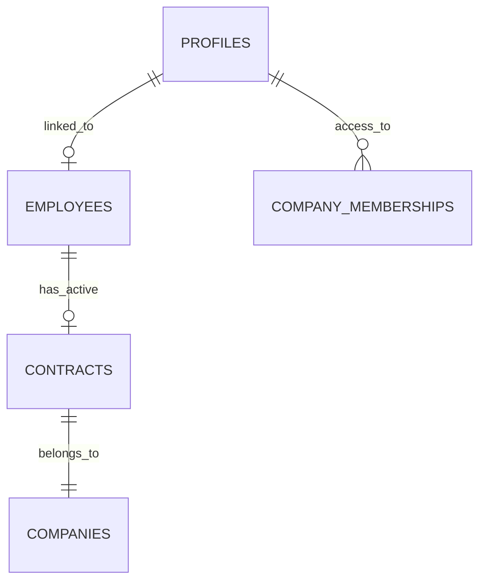

# 🔗 SSOT LOGIC - Single Source of Truth Synchronization

Este documento describe el protocolo de sincronización entre el **Módulo Administrativo** y el **Módulo de Recursos Humanos (RRHH)**.

## 1. El Concepto de "La Verdad"

En Gestor360, la **identidad legal** de un usuario pertenece a RRHH. El sistema de accesos solo gestiona la **identidad digital** (Login/Password).

| Campo | Propietario (SSOT) | Estado en Accesos |
| :--- | :--- | :--- |
| **Nombre Legal** | `employees.full_name` | Solo lectura (Bloqueado) |
| **Email Corporativo** | `employees.corporate_email` | Solo lectura (Bloqueado) |
| **Cargo (Position)** | `contracts.job_title` | Solo lectura (Bloqueado) |
| **Empresa Principal** | `contracts.company_id` | Seleccionada y Bloqueada |

## 2. Flujo de Vinculación (Blindaje Automático)

Cuando se utiliza el buscador de "Integración SSOT" en la creación o edición de un usuario:

1. **Búsqueda**: Se consulta la tabla `employees` por nombre o cédula.
2. **Selección**: Al elegir un empleado:
   - El sistema busca su `contract` activo.
   - El `linked_employee_id` se guarda en el `profile` del usuario.
   - Los campos de identidad se autocompletan y se bloquean (`disabled`).
3. **Persistencia**: Cualquier cambio en el nombre legal del empleado (ej. corrección ortográfica) en RRHH se reflejará automáticamente en el perfil administrativo en la siguiente carga.

## 3. Excepciones de Seguridad (Owner Bypass)

Solo los usuarios con rol `OWNER` pueden editar campos SSOT protegidos si la vinculación está activa. Esto permite correcciones de emergencia sin romper la base de datos de RRHH.

## 4. Usuarios Externos (Sin Vinculación)

Para consultores, auditores o personal externo que no tiene contrato en RRHH:
- Los campos de identidad son editables.
- El administrador debe elegir manualmente la **Empresa Principal**.

## 5. Modelo de Datos

---
*Ultima Actualización: 2026-04-01*
